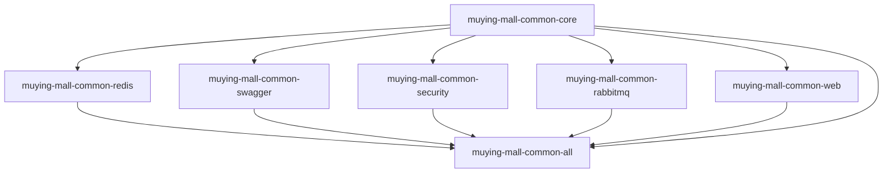

# Common模块重构设计文档

## 概述

本设计文档基于需求分析，提供了将单体`muying-mall-common`模块重构为多模块架构的详细技术方案。采用混合重构策略，既保证系统稳定性，又实现架构优化目标。

## 架构设计

### 整体架构

```
muying-mall-common (父模块 - POM)
├── muying-mall-common-core        # 核心基础模块
├── muying-mall-common-redis       # Redis缓存模块  
├── muying-mall-common-swagger     # API文档模块
├── muying-mall-common-security    # 安全认证模块
├── muying-mall-common-rabbitmq    # 消息队列模块
├── muying-mall-common-web         # Web相关模块
└── muying-mall-common-all         # 聚合模块(向后兼容)
```

### 依赖关系图



## 组件设计

### 1. muying-mall-common-core (核心模块)

**职责**：提供基础功能和通用组件

**包含功能**：
- 异常处理框架
- 枚举定义
- 常量定义  
- 通用工具类
- 基础注解
- 响应结果封装
- 分页组件

**包结构**：
```
com.muyingmall.common.core
├── annotation/          # 通用注解
├── constant/           # 系统常量
├── enums/              # 枚举定义
├── exception/          # 异常处理
├── result/             # 响应结果封装
├── utils/              # 通用工具类
└── domain/             # 基础领域对象
```

**关键依赖**：
- Spring Boot Starter
- Spring Boot Validation
- FastJSON2
- Jackson
- Apache Commons Lang3
- Apache Commons IO

### 2. muying-mall-common-redis (Redis模块)

**职责**：提供Redis缓存相关功能

**包含功能**：
- Redis配置
- 缓存工具类
- 分布式锁
- 缓存注解

**包结构**：
```
com.muyingmall.common.redis
├── config/             # Redis配置
├── service/            # 缓存服务
├── lock/               # 分布式锁
└── annotation/         # 缓存注解
```

**关键依赖**：
- muying-mall-common-core
- Spring Boot Data Redis

### 3. muying-mall-common-swagger (API文档模块)

**职责**：提供API文档生成功能

**包含功能**：
- Swagger配置
- API文档注解增强
- 接口分组配置

**包结构**：
```
com.muyingmall.common.swagger
├── config/             # Swagger配置
├── annotation/         # 文档注解
└── properties/         # 配置属性
```

**关键依赖**：
- Spring Boot Web
- SpringDoc OpenAPI

### 4. muying-mall-common-security (安全模块)

**职责**：提供安全认证相关功能

**包含功能**：
- JWT工具类
- 密码加密
- 安全注解
- 权限验证

**包结构**：
```
com.muyingmall.common.security
├── jwt/                # JWT相关
├── crypto/             # 加密工具
├── annotation/         # 安全注解
└── config/             # 安全配置
```

**关键依赖**：
- muying-mall-common-core
- JJWT
- Spring Security Crypto

### 5. muying-mall-common-rabbitmq (消息队列模块)

**职责**：提供RabbitMQ消息队列功能

**包含功能**：
- RabbitMQ配置
- 消息生产者
- 消息消费者
- 消息模板

**包结构**：
```
com.muyingmall.common.rabbitmq
├── config/             # RabbitMQ配置
├── producer/           # 消息生产者
├── consumer/           # 消息消费者
└── template/           # 消息模板
```

**关键依赖**：
- muying-mall-common-core
- Spring Boot AMQP

### 6. muying-mall-common-web (Web模块)

**职责**：提供Web相关功能

**包含功能**：
- 全局异常处理
- 请求响应拦截器
- 跨域配置
- Web工具类

**包结构**：
```
com.muyingmall.common.web
├── config/             # Web配置
├── interceptor/        # 拦截器
├── filter/             # 过滤器
└── handler/            # 异常处理器
```

**关键依赖**：
- muying-mall-common-core
- Spring Boot Web
- Jakarta Servlet API

### 7. muying-mall-common-all (聚合模块)

**职责**：向后兼容，聚合所有功能模块

**包含功能**：
- 依赖所有子模块
- 提供统一入口

## 数据模型

### 配置属性模型

```java
// Redis配置属性
@ConfigurationProperties(prefix = "muying.redis")
public class RedisProperties {
    private String keyPrefix = "muying:";
    private Duration defaultExpire = Duration.ofHours(1);
    // ...
}

// Swagger配置属性  
@ConfigurationProperties(prefix = "muying.swagger")
public class SwaggerProperties {
    private String title = "母婴商城API";
    private String version = "1.0.0";
    private String description = "母婴商城微服务API文档";
    // ...
}
```

### 响应结果模型

```java
// 统一响应结果
public class Result<T> {
    private Integer code;
    private String message;
    private T data;
    private Long timestamp;
    // ...
}

// 分页结果
public class PageResult<T> extends Result<List<T>> {
    private Long total;
    private Integer pageNum;
    private Integer pageSize;
    // ...
}
```

## 错误处理

### 异常体系设计

```java
// 基础业务异常
public class BusinessException extends RuntimeException {
    private Integer code;
    private String message;
    // ...
}

// 具体业务异常
public class ValidationException extends BusinessException { }
public class AuthenticationException extends BusinessException { }
public class AuthorizationException extends BusinessException { }
```

### 全局异常处理

```java
@RestControllerAdvice
public class GlobalExceptionHandler {
    
    @ExceptionHandler(BusinessException.class)
    public Result<Void> handleBusinessException(BusinessException e) {
        return Result.error(e.getCode(), e.getMessage());
    }
    
    @ExceptionHandler(ValidationException.class)
    public Result<Void> handleValidationException(ValidationException e) {
        return Result.error(ErrorCode.VALIDATION_ERROR, e.getMessage());
    }
}
```

## 测试策略

### 单元测试

- 每个模块独立的单元测试
- 使用JUnit 5和Mockito
- 测试覆盖率要求80%以上

### 集成测试

- 模块间依赖关系测试
- Spring Boot Test集成测试
- 自动配置功能测试

### 兼容性测试

- 现有微服务集成测试
- API兼容性验证
- 性能回归测试

## 迁移策略

### 阶段一：基础架构搭建
1. 创建父POM和子模块结构
2. 建立基础的core模块
3. 配置Maven依赖关系

### 阶段二：核心功能迁移
1. 迁移异常处理框架
2. 迁移工具类和常量
3. 迁移响应结果封装

### 阶段三：功能模块拆分
1. 拆分Redis相关功能
2. 拆分Swagger相关功能  
3. 拆分安全相关功能
4. 拆分RabbitMQ相关功能
5. 拆分Web相关功能

### 阶段四：兼容性保障
1. 创建聚合模块
2. 验证现有项目兼容性
3. 提供迁移指南

## 部署考虑

### Maven配置

- 父POM统一管理依赖版本
- 子模块独立版本控制
- 支持快照版本和正式版本

### CI/CD集成

- 自动化构建和测试
- 独立模块发布流程
- 版本兼容性检查

### 监控和日志

- 模块级别的性能监控
- 统一的日志格式
- 错误追踪和报警

## 风险评估

### 技术风险

- **依赖冲突**：通过版本统一管理降低风险
- **循环依赖**：严格的架构设计避免循环依赖
- **性能影响**：通过基准测试验证性能

### 业务风险

- **功能回归**：完整的测试覆盖保障功能完整性
- **兼容性问题**：提供聚合模块确保向后兼容
- **迁移成本**：分阶段迁移降低风险

### 缓解措施

- 完整的自动化测试
- 详细的迁移文档
- 分阶段发布策略
- 回滚预案准备