# 母婴商城微服务技术架构图

## Mermaid架构图代码

```mermaid
graph TB
    %% 外部用户和系统
    subgraph "外部系统"
        User[👥 用户/客户端]
        Admin[👨‍💼 管理员]
        Mobile[📱 移动应用]
        Web[💻 Web应用]
        ThirdPay[💳 第三方支付<br/>支付宝/微信]
        Logistics[🚚 物流公司API<br/>顺丰/圆通/中通]
    end

    %% API网关层
    subgraph "网关层"
        Gateway[🌐 API Gateway<br/>Spring Cloud Gateway<br/>:8080]
    end

    %% 微服务层
    subgraph "微服务集群"
        direction TB
        
        subgraph "核心业务服务"
            UserService[👤 用户服务<br/>muying-mall-user<br/>:8001]
            ProductService[🛒 商品服务<br/>muying-mall-product<br/>:8002]
            OrderService[📝 订单服务<br/>muying-mall-order<br/>:8003]
            PaymentService[💰 支付服务<br/>muying-mall-payment<br/>:8004]
        end
        
        subgraph "辅助业务服务"
            SearchService[🔍 搜索服务<br/>muying-mall-search<br/>:8005]
            LogisticsService[🚛 物流服务<br/>muying-mall-logistics<br/>:8006]
            CommentService[💬 评论服务<br/>muying-mall-comment<br/>:8007]
            PointsService[🎁 积分服务<br/>muying-mall-points<br/>:8008]
            AdminService[⚙️ 管理服务<br/>muying-mall-admin<br/>:8009]
        end
    end

    %% 服务治理层
    subgraph "服务治理"
        Nacos[📋 Nacos<br/>注册中心/配置中心<br/>:8848]
        Sentinel[🛡️ Sentinel<br/>流量防护<br/>:8858]
        Zipkin[🔍 Zipkin<br/>链路追踪<br/>:9411]
    end

    %% 数据存储层
    subgraph "数据存储层"
        MySQL[(🗃️ MySQL 8.0<br/>主数据库<br/>:3306)]
        Redis[(⚡ Redis 7.x<br/>缓存数据库<br/>:6379)]
        ES[(🔎 Elasticsearch<br/>搜索引擎<br/>:9200)]
        Kibana[📊 Kibana<br/>日志分析<br/>:5601]
    end

    %% 公共模块
    subgraph "公共组件"
        Common[📦 公共模块<br/>muying-mall-common<br/>工具类/通用配置]
    end

    %% 连接关系
    User --> Gateway
    Admin --> Gateway
    Mobile --> Gateway
    Web --> Gateway

    Gateway --> UserService
    Gateway --> ProductService
    Gateway --> OrderService
    Gateway --> PaymentService
    Gateway --> SearchService
    Gateway --> LogisticsService
    Gateway --> CommentService
    Gateway --> PointsService
    Gateway --> AdminService

    %% 服务治理连接
    UserService --> Nacos
    ProductService --> Nacos
    OrderService --> Nacos
    PaymentService --> Nacos
    SearchService --> Nacos
    LogisticsService --> Nacos
    CommentService --> Nacos
    PointsService --> Nacos
    AdminService --> Nacos
    Gateway --> Nacos

    UserService --> Sentinel
    ProductService --> Sentinel
    OrderService --> Sentinel
    PaymentService --> Sentinel
    SearchService --> Sentinel
    LogisticsService --> Sentinel
    CommentService --> Sentinel
    PointsService --> Sentinel
    AdminService --> Sentinel

    UserService --> Zipkin
    ProductService --> Zipkin
    OrderService --> Zipkin
    PaymentService --> Zipkin
    SearchService --> Zipkin
    LogisticsService --> Zipkin
    CommentService --> Zipkin
    PointsService --> Zipkin
    AdminService --> Zipkin

    %% 数据存储连接
    UserService --> MySQL
    ProductService --> MySQL
    OrderService --> MySQL
    PaymentService --> MySQL
    LogisticsService --> MySQL
    CommentService --> MySQL
    PointsService --> MySQL
    AdminService --> MySQL

    UserService --> Redis
    ProductService --> Redis
    OrderService --> Redis
    PaymentService --> Redis
    SearchService --> Redis
    LogisticsService --> Redis
    CommentService --> Redis
    PointsService --> Redis

    SearchService --> ES
    AdminService --> ES
    ES --> Kibana

    %% 第三方服务连接
    PaymentService --> ThirdPay
    LogisticsService --> Logistics

    %% 公共模块连接
    UserService -.-> Common
    ProductService -.-> Common
    OrderService -.-> Common
    PaymentService -.-> Common
    SearchService -.-> Common
    LogisticsService -.-> Common
    CommentService -.-> Common
    PointsService -.-> Common
    AdminService -.-> Common

    %% 样式定义
    classDef userClass fill:#e1f5fe,stroke:#0277bd,stroke-width:2px
    classDef gatewayClass fill:#f3e5f5,stroke:#7b1fa2,stroke-width:2px
    classDef serviceClass fill:#e8f5e8,stroke:#388e3c,stroke-width:2px
    classDef governanceClass fill:#fff3e0,stroke:#f57c00,stroke-width:2px
    classDef storageClass fill:#fce4ec,stroke:#c2185b,stroke-width:2px
    classDef thirdpartyClass fill:#f1f8e9,stroke:#689f38,stroke-width:2px

    class User,Admin,Mobile,Web userClass
    class Gateway gatewayClass
    class UserService,ProductService,OrderService,PaymentService,SearchService,LogisticsService,CommentService,PointsService,AdminService serviceClass
    class Nacos,Sentinel,Zipkin governanceClass
    class MySQL,Redis,ES,Kibana storageClass
    class ThirdPay,Logistics thirdpartyClass
```

## 在线查看地址

您可以通过以下方式查看架构图：

1. **GitHub/GitLab**: 如果您的项目托管在GitHub或GitLab上，Mermaid图会自动渲染
2. **Mermaid Live Editor**: https://mermaid.live/
3. **Visual Studio Code**: 安装Mermaid插件预览
4. **Typora**: 支持Mermaid图表渲染

## 使用方法

将上面的mermaid代码复制到支持Mermaid的Markdown编辑器中即可查看架构图。